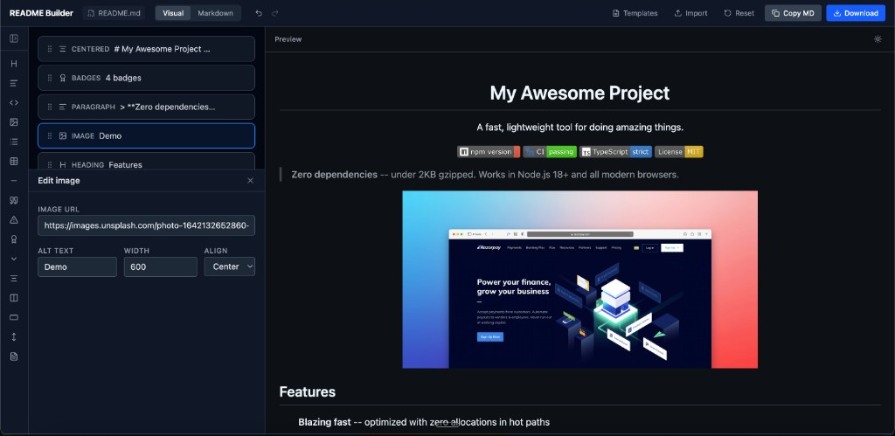

<h1 align="center">readme-builder</h1>

<p align="center">
  <strong>Stop writing markdown by hand. Drag blocks, get a README.</strong>
</p>

<p align="center">
  Visual editor that turns drag-and-drop blocks into GitHub-flavored markdown.<br>
  Live preview, templates, import from GitHub repos, export when you're done.
</p>

<p align="center">
  <a href="https://ofershap.github.io/readme-builder"></a>
  &nbsp;
  <a href="#features"></a>
  &nbsp;
  <a href="#self-hosting"></a>
</p>

<p align="center">
  <a href="https://github.com/ofershap/readme-builder/stargazers"></a>
  &nbsp;
  <a href="https://github.com/ofershap/readme-builder/actions/workflows/ci.yml"></a>
  <a href="https://www.typescriptlang.org/"></a>
  <a href="LICENSE"></a>
  <a href="https://makeapullrequest.com"></a>
</p>

---

## Your README Shouldn't Take Longer Than Your Code

You just built something cool. Now you need a README, and suddenly you're juggling markdown syntax, badge URLs, table alignment, and GitHub-flavored quirks. You know the drill:

- Copy-paste badge URLs from shields.io, typo the repo name, debug for 10 minutes
- Manually align tables, forget a pipe character, the whole thing breaks
- Check how the markdown renders by pushing to GitHub and refreshing

README Builder gives you a visual canvas where you drag blocks (headings, badges, code, tables, images, alerts) into place and see exactly how GitHub will render them. When it looks right, copy the markdown or export the file. Done.



## Features

| | |
|---|---|
| **15 block types** | Headings, badges, code, tables, lists, images, alerts, details/spoilers, blockquotes, horizontal rules, and more |
| **Live preview** | GitHub-flavored rendering updates as you type, including GFM alerts and tables |
| **Drag and drop** | Reorder blocks visually with `@dnd-kit` |
| **Badge editor** | Visual badge builder with color swatches, logo picker (30+ icons), live/static toggle |
| **Import** | Paste raw markdown, pick a file from your computer, or fetch any GitHub repo's README |
| **Templates** | Start from "Minimal Library" or "Full Project" templates, or build from scratch |
| **Undo/Redo** | Full history with `Cmd+Z` / `Cmd+Shift+Z` |
| **Auto-save** | Blocks persist in localStorage across sessions |
| **Markdown tab** | Switch to raw markdown view with syntax highlighting (CodeMirror) |
| **Dark/Light preview** | Toggle preview theme to match GitHub dark or light mode |
| **Export** | Download as `.md` file with your chosen filename |

## Tech Stack

| | |
|---|---|
| **Framework** |  |
| **Language** |  |
| **Styling** |  |
| **Build** |  |
| **State** |  + zundo (time travel) |
| **Editor** |  |
| **Drag & Drop** | @dnd-kit/react |
| **Markdown** | react-markdown + remark-gfm + rehype-raw |

## Self-Hosting

The app is fully client-side. No backend, no auth, no tracking. Clone and run:

```bash
git clone https://github.com/ofershap/readme-builder.git
cd readme-builder
npm install
npm run dev
```

Open `http://localhost:5173`. That's it.

For production, build and serve the static files from anywhere:

```bash
npm run build
npx serve dist
```

## Keyboard Shortcuts

| Shortcut | Action |
|---|---|
| `Cmd+Z` | Undo |
| `Cmd+Shift+Z` | Redo |
| `Cmd+Shift+C` | Copy markdown to clipboard |
| `Delete` / `Backspace` | Remove selected block |

## Contributing

Contributions welcome. See [CONTRIBUTING.md](CONTRIBUTING.md) for guidelines.

## Author

[](https://gitshow.dev/ofershap)

[](https://linkedin.com/in/ofershap)
[](https://github.com/ofershap)

---

If this helped you, [star the repo](https://github.com/ofershap/readme-builder), [open an issue](https://github.com/ofershap/readme-builder/issues) if something breaks, or [start a discussion](https://github.com/ofershap/readme-builder/discussions).

## License

[MIT](LICENSE) &copy; [Ofer Shapira](https://github.com/ofershap)
